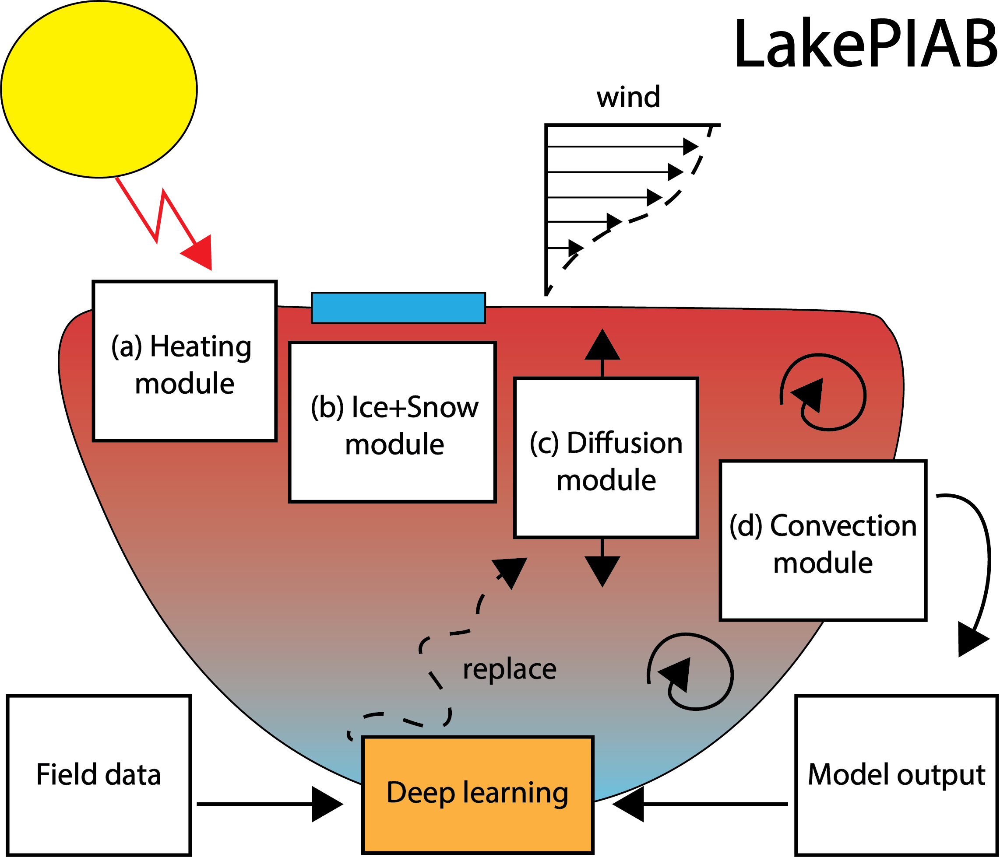

# LakePIAB
Authors: Robert Ladwig, Arka Daw, Cal Buelo, Abhilash Neog

LakePIAB (Lake Physics in a Box) - a Modular Compositional Learning framework combining process-based model formulations and deep learning to simulate 1D vertical water temperature dynamics.

\src includes scripts for running the models:
- run_ProcessModel.py runs the process-based model for generating training data
- run_DeepModel_noModule.py run the pretrained deep learning model (no modularisation)
- run_DeepModel_noProcess.py runs the deep learning model (no process)
- run_HybridModel.py runs the hybrid MCL models
- run_***_collapse.py runs the models to explore stability perturbations
- processBased_lakeModel_functions.py includes model source code
- oneD_HeatMixing_Functions.py incldues ancillary model source code

Additionally, this folder includes R-scripts to analyse the model outputs
- physicalCalculations.R includes code to explore the performance of the hybrid MCL model
- stability.R includes code to highlight perturbations by the hybrid MCL model

\output and \stability include model output files

\figs includes final manuscript figures

\input includes input data

\MCL includes the Jupyter notebooks for model pretraining and fine-tuning

Note that for running the scripts you need to decompress the zip files in \input and \MCL\02_training

